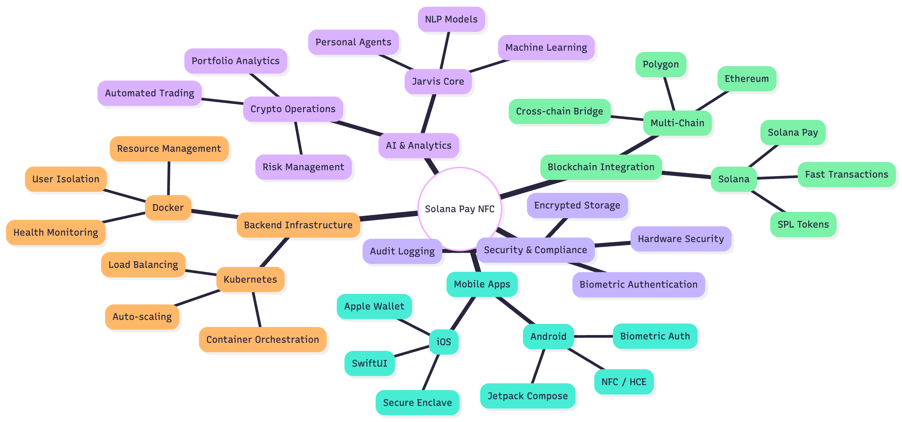
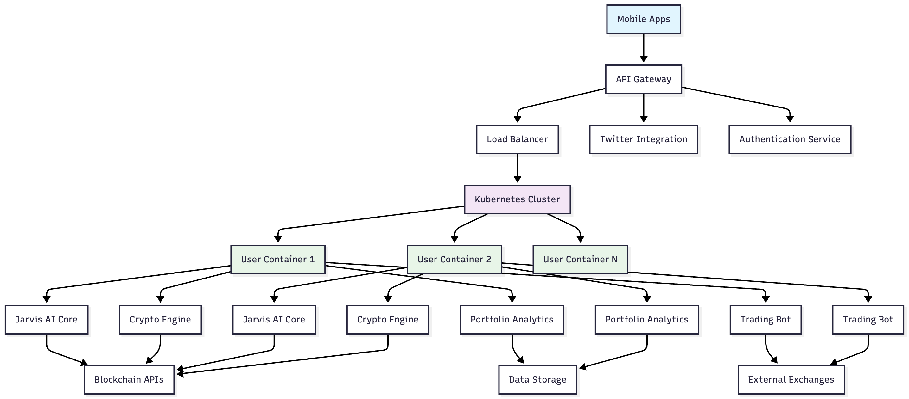
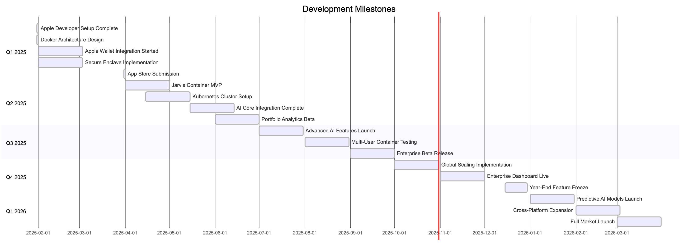

# Solana Pay with NFC

Cross-platform application that combines Solana Pay protocol with NFC technology and AI assistance. Tap two phones together to transfer SOL without QR codes or manual wallet addresses, with Jarvis AI to help manage your crypto operations.

## Overview

This project demonstrates how NFC can make cryptocurrency payments work like contactless card payments, submitted to Solana Colosseum.

### Problem

Crypto payments require:
- Manual copying/pasting of wallet addresses  
- QR code scanning
- Risk of human error in address entry
- Multiple app switches

### Solution

Tap two phones together to initiate a Solana Pay transaction. NFC transmits the payment request between devices.

## Key Features

- **Cross-Platform Support**: Available on both Android and iOS
- **Twitter Authentication**: Social login with unified wallet management through XReplyAgent
- **NFC Payments**: Tap phones together to transfer SOL (Android with full NFC support)
- **QR Code Payments**: Camera-based payment scanning (iOS implementation while awaiting Apple Wallet integration)
- **Biometric Security**: Hardware-backed encryption with biometric authentication
- **Solana Pay Protocol**: Transactions on Solana blockchain
- **Jarvis AI Assistant**: Voice-powered AI to help with crypto operations and Twitter wallet management
- **Twitter Wallet Integration**: Manage wallets and transactions via Twitter through XReplyAgent
- **Multi-Chain Wallet Management**: Support for multiple blockchain networks
- **Modern UI**: Jetpack Compose (Android) and SwiftUI (iOS)
- **Multi-language Support**: English and German

## Technical Architecture

The application follows clean architecture principles across both platforms:

### Project Structure
```
solana_pay_with_nfc/
├── android/                    # Android application
├── ios/                        # iOS application  
├── XReplyAgent/               # Backend API (git submodule)
└── README.md                  # This documentation
```

### Complete Technology Stack



The above diagram illustrates our comprehensive technology stack, showing how different components integrate:

- **Mobile Apps** (iOS/Android) with platform-specific technologies
- **Backend Infrastructure** powered by Docker and Kubernetes
- **AI & Analytics** featuring Jarvis Core with machine learning capabilities
- **Blockchain Integration** supporting multi-chain operations
- **Security & Compliance** with hardware-backed authentication

### Jarvis Container Architecture



Our revolutionary Jarvis system provides each user with isolated Docker containers containing:

- **Personal AI Agents** with individual learning capabilities
- **Crypto Operations Engine** for automated portfolio management
- **Portfolio Analytics** with real-time insights
- **Trading Bots** for automated strategy execution
- **Secure Data Storage** isolated per user

### Android (`android/app/src/main/java/com/dag/mypayandroid/`)

```
com.dag.mypayandroid/
├── base/                          # Core infrastructure & shared components
│   ├── helper/
│   │   ├── blockchain/           # Web3Auth & Solana integration
│   │   ├── security/            # NFC, Biometric & cryptographic operations
│   │   ├── audio/               # Speech recognition for Jarvis
│   │   └── system/              # System-level utilities
│   └── solanapay/               # Solana Pay protocol implementation
├── feature/                      # Feature-specific modules
│   ├── home/                    # Main payment interface
│   ├── login/                   # Authentication flow
│   ├── settings/                # App configuration
│   └── jarvis/                  # AI assistant feature
└── ui/                          # Design system & themes
```

### iOS (`ios/MyPayIos/MyPayIos/`)

```
MyPayIos/
├── Base/                         # Core infrastructure & shared components
│   ├── Components/              # Shared UI components
│   ├── Configuration/           # App configuration
│   ├── Navigation/              # Navigation system
│   ├── Network/                 # API clients
│   ├── Security/                # Biometric authentication
│   ├── SolanaPay/              # Solana Pay protocol implementation
│   ├── Storage/                 # Data storage
│   ├── ViewModels/              # Base view models
│   └── Wallet/                  # Wallet management
├── Features/                     # Feature-specific modules
│   ├── Home/                    # Main payment interface
│   ├── Login/                   # Authentication flow
│   ├── Settings/                # App configuration
│   ├── Splash/                  # App initialization
│   └── Jarvis/                  # AI assistant feature
└── Resources/                    # Assets and configurations
```

### Core Components

#### Blockchain Integration

**Android** (`base/helper/blockchain/`):

**Authentication Helper** (`AuthHelper.kt`, `AuthHelperImpl.kt`):
- Twitter OAuth integration for social authentication
- Ed25519 private key generation for Solana
- Session management with XReplyAgent backend
- Unified wallet management across Twitter and mobile app

```kotlin
interface AuthHelper {
    suspend fun loginWithTwitter(): CompletableFuture<AuthResponse>
    suspend fun logOut(): CompletableFuture<Void>
    fun getSolanaPrivateKey(): String
    fun getUserInfo(): UserInfo
    suspend fun isUserAuthenticated(): Boolean
}
```

**Solana Helper** (`SolanaHelper.kt`, `SolanaHelperImpl.kt`):
- Creates and manages Solana Pay URLs
- Handles SOL and SPL token transfers
- Integrates with Solana RPC for transaction processing
- Transaction signing and broadcasting

```kotlin
interface SolanaHelper {
    fun prepareSolanaPay(
        transferRequestField: TransferRequestURLFields,
        onUrlReady: (tx: URI)-> Unit
    )
    suspend fun receiveSolanaPayAndMakePayment(
        keypair: Keypair,
        paymentUrl: String,
        onSigned: (tx: Transaction)-> Unit
    )
}
```

**iOS** (`Base/SolanaPay/`, `Base/Wallet/`):

**SolanaHelper** (`SolanaHelper.swift`):
- Solana Pay URL creation and parsing
- Transaction building and signing
- RPC integration for blockchain interaction
- Multi-chain support

**WalletManager** (`WalletManager.swift`):
- Secure key storage using iOS Keychain
- Biometric authentication integration
- Multi-chain wallet support
- Hardware-backed security

#### Security Layer

**Android** (`base/helper/security/`):

**NFC Communication** (`NFCHelper.kt`, `MyHostApduService.kt`):
- Host Card Emulation (HCE) - converts phone to card terminal via HostApduService
- Reader and Tag modes for bidirectional communication
- APDU (Application Protocol Data Unit) command processing
- Custom AID (Application Identifier): `F0010203040506`

```kotlin
enum class NFCMode { TAG, READER }

interface NFCListener {
    fun onMessageReceived(message: String)
    fun onNFCError(error: String)
    fun onNFCStateChanged(mode: NFCMode)
}
```

**Biometric Security** (`BiometricHelper.kt`):
- Android Keystore integration for hardware-backed security
- Support for fingerprint, face unlock, and device PIN
- AES-256-CBC encryption with biometric-protected keys
- Key generation with `setUserAuthenticationRequired(true)`

**iOS** (`Base/NfcHelper.swift`, `Base/Security/`):

**NFC Communication** (`NfcHelper.swift`):
- CoreNFC framework integration
- ISO14443 and NDEF support
- HCE communication with Android devices
- Custom media type for payment data: `application/vnd.mypayios.solanapay`

**Biometric Security** (`BiometricHelper.swift`):
- iOS Keychain Services integration
- Touch ID, Face ID, and passcode support
- Hardware-backed encryption
- Secure Enclave protection

#### Solana Pay Implementation

**Android** (`base/solanapay/`):

**URL Encoding/Decoding** (`EncodeURL.kt`, `ParseURL.kt`):
- Solana Pay URL generation
- Transfer requests with metadata
- URL validation and parsing with error handling
- Standard Solana Pay format: `solana:<recipient>?amount=<amount>`

**Transaction Creation** (`CreateTransfer.kt`):
- Builds Solana transactions for SOL and SPL tokens
- Associated Token Account (ATA) creation
- Transaction fees and recent blockhash
- Signs transactions with user's private key

```kotlin
data class TransferRequestURLFields(
    val recipient: Recipient,
    val amount: Amount,
    val tokenDecimal: Int,
    val splToken: SPLToken? = null,
    val reference: References? = null,
    val label: Label? = null,
    val message: Message? = null,
    val memo: Memo? = null
)
```

**iOS** (`Base/SolanaPay/`):

**URL Encoding/Decoding** (`SolanaPayURLEncoder.swift`, `SolanaPayURLParser.swift`):
- Solana Pay URL generation and parsing
- Transfer request validation
- Error handling and type safety
- Protocol compliance

**Transaction Creation** (`SolanaPayTransferCreator.swift`):
- Transaction building for SOL transfers
- Multi-chain transaction support
- Fee calculation and optimization
- Signature management

#### Jarvis AI Assistant

**Android** (`feature/jarvis/`):

**JarvisViewModel** (`JarvisVM.kt`):
- Speech recognition management using Android Speech API
- Voice transcription and confirmation flow
- Backend communication with Jarvis API
- State management for listening, processing, and response states

**JarvisView** (`JarvisView.kt`):
- Voice wave animation during listening
- Touch-to-talk interface with visual feedback
- Status cards for user feedback
- Permission handling for microphone access

```kotlin
@HiltViewModel
class JarvisVM : BaseVM<JarvisVS> {
    fun startListening()
    fun stopListening()
    fun confirmAndSend()
    fun sendToBackend(input: String)
}
```

**iOS** (`Features/Jarvis/`):

**JarvisViewModel** (`JarvisViewModel.swift`):
- Speech recognition using iOS Speech framework
- Audio session management with AVFoundation
- Real-time transcription and processing
- Backend API integration

**JarvisView** (`JarvisView.swift`):
- SwiftUI voice interface with animations
- Biometric authentication integration
- Voice wave visualization
- Alert-based confirmation dialogs

```swift
final class JarvisViewModel: BaseViewModel {
    func startListening()
    func stopListening()
    func confirmAndSend()
    func sendToBackend(transcription: String)
}
```

**Backend Integration**:
- RESTful API communication with [XReplyAgent](https://github.com/DogukanGun/XReplyAgent) (included as git submodule in `XReplyAgent/`)
- Twitter OAuth authentication and wallet management
- Real-time AI responses for crypto operations
- Twitter-based wallet operations and transaction management
- Secure token-based authentication
- Error handling and retry mechanisms

#### System Integration

**Android** (`base/helper/system/`):

**Activity Management** (`ActivityHolder.kt`):
- Activity lifecycle management
- Current activity context for biometric operations
- Activity transitions and state management

**Alert Dialog System** (`AlertDialogManager.kt`):
- Dialog management
- Error handling and user feedback
- Various dialog types and actions

**iOS** (`Base/Navigation/`, `Base/ViewModels/`):

**Navigation System** (`NavigationCoordinator.swift`, `AppRouter.swift`):
- SwiftUI navigation management
- Deep linking support
- Route coordination between features

**Base ViewModels** (`BaseViewModel.swift`):
- Common ViewModel functionality
- State management patterns
- Error handling infrastructure

## Payment Flow

### Sending Money (Initiating Payment)

1. **User Authentication**: User logs in via Twitter OAuth through XReplyAgent
2. **Amount Entry**: User specifies amount to send in the ReceiveView
3. **NFC Tag Mode**: App switches to NFC Tag mode (HCE)
4. **Solana Pay URL Generation**: Creates standardized payment URL
5. **NFC Transmission**: URL stored in SharedPreferences for HCE service
6. **Tap Detection**: When another phone taps, HCE service responds with payment data

### Receiving Money (Processing Payment)

1. **NFC Reader Mode**: Receiving phone operates as card reader
2. **Tag Discovery**: Detects sender phone acting as card terminal via HostApduService
3. **APDU Communication**: Sends SELECT command to HCE service
4. **Data Reception**: Receives Solana Pay URL from sender
5. **URL Parsing**: Validates and extracts payment details
6. **Transaction Creation**: Builds Solana transaction
7. **Biometric Confirmation**: User authenticates to access private key
8. **Transaction Signing**: Signs transaction with recovered private key
9. **Blockchain Submission**: Broadcasts transaction to Solana network

## Security Features

### Multi-Layer Security

1. **Hardware Security Module**: Android Keystore for key protection
2. **Biometric Authentication**: Required for sensitive operations
3. **Encrypted Storage**: Private keys encrypted with hardware-backed keys
4. **Session Management**: Twitter OAuth session handling through XReplyAgent
5. **Input Validation**: Validation of user inputs and URLs
6. **Error Handling**: Error handling without exposing data

### NFC Security

- **Custom AID**: Uses Application Identifier to avoid conflicts
- **Data Validation**: All received NFC data undergoes validation
- **Timeout Mechanisms**: NFC operations have timeouts
- **Error Recovery**: Error handling for NFC communication failures

## Getting Started

### Prerequisites

#### Android
- Android 6.0+ (API level 23+)
- NFC-enabled Android device
- Microphone permission for Jarvis AI
- Active internet connection
- Biometric authentication or device PIN set up

#### iOS  
- iOS 13.0+
- NFC-enabled iPhone (iPhone 7 or newer)
- Microphone permission for Jarvis AI
- Camera permission for QR code scanning
- Active internet connection
- Touch ID, Face ID, or device passcode set up

### Installation

#### Clone Repository with Submodules
```bash
git clone --recursive https://github.com/DogukanGun/solana_pay_with_nfc.git
cd solana_pay_with_nfc
```

If you already cloned the repository, initialize the submodules:
```bash
git submodule update --init --recursive
```

#### XReplyAgent Backend Setup
1. Navigate to the XReplyAgent directory: `cd XReplyAgent/`
2. Follow the setup instructions in `XReplyAgent/README.md`
3. Run the backend server to enable Jarvis AI functionality

#### Android Development
1. Open Android project in Android Studio
2. Configure Twitter OAuth credentials in your build configuration
3. Set up Solana RPC endpoint (Mainnet/Devnet/Testnet)
4. Configure XReplyAgent API endpoint (your local or deployed backend)
5. Build and install on NFC-enabled Android devices

#### iOS Development
1. Open `ios/MyPayIos.xcodeproj` in Xcode
2. Configure App ID with NFC capability in Apple Developer Portal
3. Set up Twitter OAuth credentials in app configuration
4. Configure XReplyAgent API endpoint (your local or deployed backend)
5. Build and install on NFC-enabled iOS devices (iPhone 7 or newer)

### Configuration

#### Android
Update your `local.properties` or build configuration with:
```properties
TWITTER_API_KEY=your_twitter_api_key
TWITTER_API_SECRET=your_twitter_api_secret
SOLANA_RPC_URL=https://api.mainnet-beta.solana.com
XREPLYAGENT_API_URL=your_xreplyagent_backend_url
```

#### iOS
Update your app configuration with:
```swift
// Configuration constants
TWITTER_API_KEY = "your_twitter_api_key"
TWITTER_API_SECRET = "your_twitter_api_secret"
SOLANA_RPC_URL = "https://api.mainnet-beta.solana.com"
XREPLYAGENT_API_URL = "your_xreplyagent_backend_url"
```

## Testing

The application supports testing on Mainnet and Devnet:

- **Devnet**: For development and testing
- **Testnet**: For pre-production testing
- **Mainnet**: For production use with real SOL

## Supported Features

### Core Features (Both Platforms)
- **SOL transfers via NFC tap**: Seamless phone-to-phone payments
- **Twitter-based authentication**: Social login integration through XReplyAgent for user onboarding
- **Twitter wallet management**: Manage wallets and execute transactions via Twitter
- **Biometric wallet security**: Hardware-backed key protection
- **Multi-language support**: English and German
- **Settings management**: Customizable app preferences
- **Transaction metadata and memos**: Rich payment information
- **Reference tracking for payments**: Transaction monitoring

### Android Features
- **Jarvis AI Assistant**: Voice-powered crypto assistant
- **Host Card Emulation (HCE)**: Advanced NFC communication for tapless payments
- **SPL token support**: Multi-token transactions (testing in progress)
- **Material Design 3**: Modern Android UI with Jetpack Compose
- **Google Play Store**: Currently in the publishing process

### iOS Features  
- **Jarvis AI Assistant**: Voice-powered crypto assistant with Speech framework
- **QR Code scanning**: Camera-based payment initiation (temporary solution)
- **Multi-chain wallet management**: Support for multiple blockchain networks
- **CoreNFC integration**: Limited NFC capabilities (pending Apple Wallet integration)
- **SwiftUI interface**: Modern iOS UI patterns

**Note**: iOS app currently uses QR code scanning as we are planning to secure funding or grants to cover the licensing fees required for Apple Wallet integration, which would enable full tapless payment functionality similar to the Android version.

## Project Status

### Current Development
- **Android**: Full NFC implementation with Host Card Emulation, currently in Google Play Store publishing process
- **iOS**: QR code-based implementation while pursuing funding for Apple Wallet integration licensing
- **Jarvis AI**: Voice assistant integrated on both platforms with backend API support

### Development Roadmap



Our comprehensive development timeline spans from Q1 2025 through Q1 2026, featuring:

**Q1 2025**: iOS wallet implementation with Apple Developer setup, Apple Wallet integration, and Secure Enclave implementation

**Q2 2025**: Jarvis container MVP launch with Kubernetes cluster setup and AI core integration

**Q3 2025**: Advanced AI features, multi-user container testing, and enterprise beta release

**Q4 2025**: Global scaling implementation, enterprise dashboard, and performance optimization

**Q1 2026**: Predictive AI models, cross-platform expansion, and full market launch

### Future Plans
- Secure grants or funding to cover Apple Wallet integration licensing fees
- Enable full tapless payment functionality on iOS matching Android capabilities
- Expand multi-chain support across additional blockchain networks

## License

This project demonstrates the integration of Twitter authentication, Solana Pay, and NFC technologies through XReplyAgent, submitted to Solana Colosseum.

### Why This Matters

This project bridges the gap between contactless payments and decentralized finance. By making crypto payments work through phone tapping, it removes barriers to cryptocurrency adoption and creates an intuitive payment experience.

The combination of Twitter authentication through XReplyAgent, Solana transactions, and NFC/QR capabilities creates a foundation for peer-to-peer payments across different platforms and technical constraints, enabling users to manage their crypto wallets both through the mobile app and Twitter interactions.
